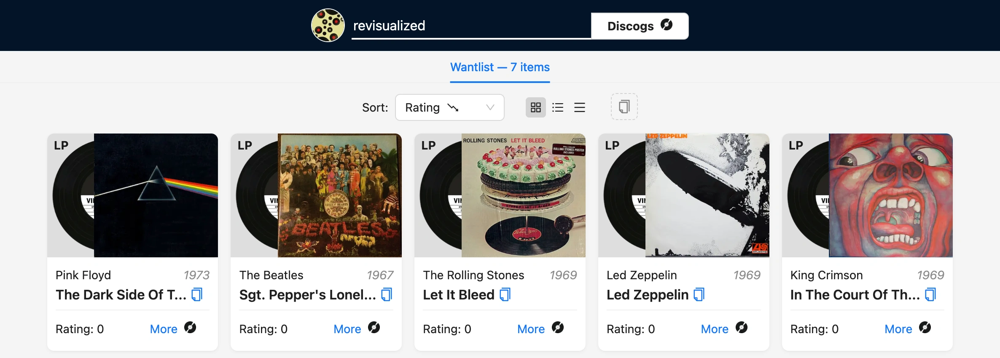

# Дневник разработки Discogs Revisualized: Желаемый функционал и функционал МВП

Планы на функционал приложения. 

::: warning Обратите внимание, что МВП-версия будет немного отличаться
:::

## Что будет в полном приложении

### Обёртка над API

Приложение будет использовать обёртку над [API Discogs](https://www.discogs.com/developers), что позволит мне использовать все возможности оригинального API для просмотра вишлиста и коллекций, но с более удобными типами возвращаемых значений и возможностью кэшировать ответы.

### Просмотр вишлиста и коллекции

Пользователи смогут просматривать любой публичный вишлист и любую публичную коллекцию виниловых пластинок. Как и на основном сайте, они будут отображать всю доступную информацию о релизах, которые тот или иной пользователь записал в свой список,  включая обложку альбома, имя артиста, название альбома, год выпуска и т.д.

### Ссылки на профиль и музыкальные релизы

Пользователи смогут перейти на профиль аккаунта на основном сайте, а также на страницу каждого музыкального релиза. Моё приложение будет использоваться только лишь как красивая обертка вишлистов и коллекции — для более подробной информации нужно будет посещать оригинальный сайт.

### Карточка профиля со все доступной информацией

Также в приложении можно будет увидеть всю доступную публичную информацию о пользователе в красивом виде.

### Три вида лэйаута

Приложение будет предлагать три вида лэйаута, аналогичные основному сайту [Discogs.com](http://discogs.com/). Это позволит пользователям выбрать наиболее удобный для них способ отображения информации — в виде сетки, таблицы с картинками или таблицы без картинок.

### Сортировка данных

Приложение будет поддерживать мощную сортировку данных, доступную из [API Discogs](https://www.discogs.com/developers). Пользователи смогут сортировать коллекции и вишлисты по различным критериям, таким как жанр, год выпуска, артист и проч., что позволит быстро находить нужные пластинки.

### Сохранение вида лэйаута и сортировки в закодированном виде

Вид лэйаута и сортировки можно будет передавать другим пользователям в виде закодированных ссылок — таким образом вы сможете передать изначальные настройки списка, который хотите расшарить с друзьями.

## Чего не будет в приложении

### Регистрация и авторизация

В приложении не будет возможности регистрации и авторизации пользователей. Я сосредоточусь на функционале, связанном с отображением коллекциии и вишлистов, используя существующие аккаунты `Discogs`.

### Поиск по коллекции и вишлисту

Пользователи смогут просматривать публичные списки, но в приложении не будет встроенного поиска по коллекции и вишлисту, так как для него требуется авторизация.

### Добавление в коллекцию и вишлист

Пользователи не смогут добавлять новые пластинки в свою коллекцию или вишлист непосредственно через моё приложение. Этот функционал останется на стороне `Discogs`, и все изменения будут происходить через их интерфейс.

### Остальной функционал сайта

Приложение не будет включать весь остальной функционал, доступный на основном сайте `Discogs`. Это значит, что такие возможности, как покупка и продажа пластинок, участие в форуме, управление списками друзей и другие специализированные функции останутся за рамками проекта. Фокус проекта — красивое отображение публичных списков.

## Приблизительный дизайн

Для начальной версии приложения я планирую использовать стандартные элементы из библиотеки компонентов [Ant Design](https://ant.design/). Это позволит быстро создать пользовательский интерфейс с относительно современным дизайном.

Интерфейс будет адаптивным, чтобы приложение корректно отображалось на различных устройствах, включая мобильные телефоны, планшеты и десктопы.

В будущем, по мере развития проекта, планирую кастомизацию и расширение компонентов `Ant Design` для повышения визуальной айдентики.

## Фичи MVP

Всё вышеописанное актуально для полной версии приложения. На МВП же я сосредоточусь только на этих аспектах: Таблица

Обёртка над API

Просмотр вишлиста (без коллекции)

Ссылки на профиль и музыкальные релизы

Три вида лэйаута

Сортировка данных (только по рейтингу)

---

В следующей статье расскажу о создании обёртки для API.